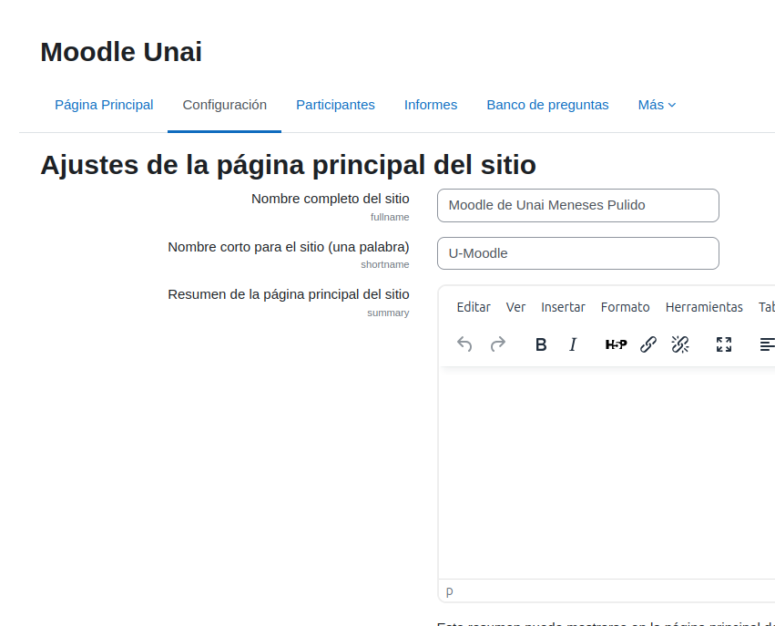
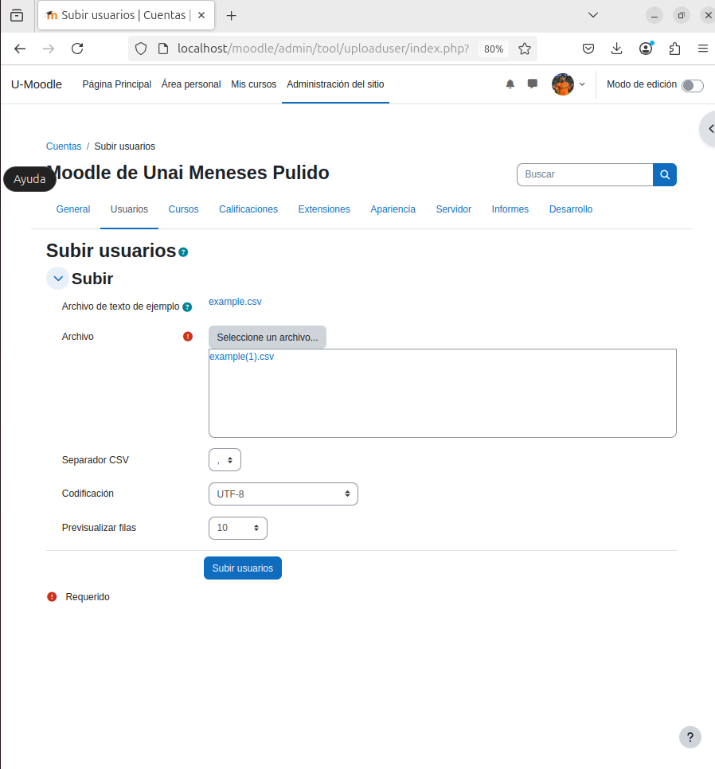
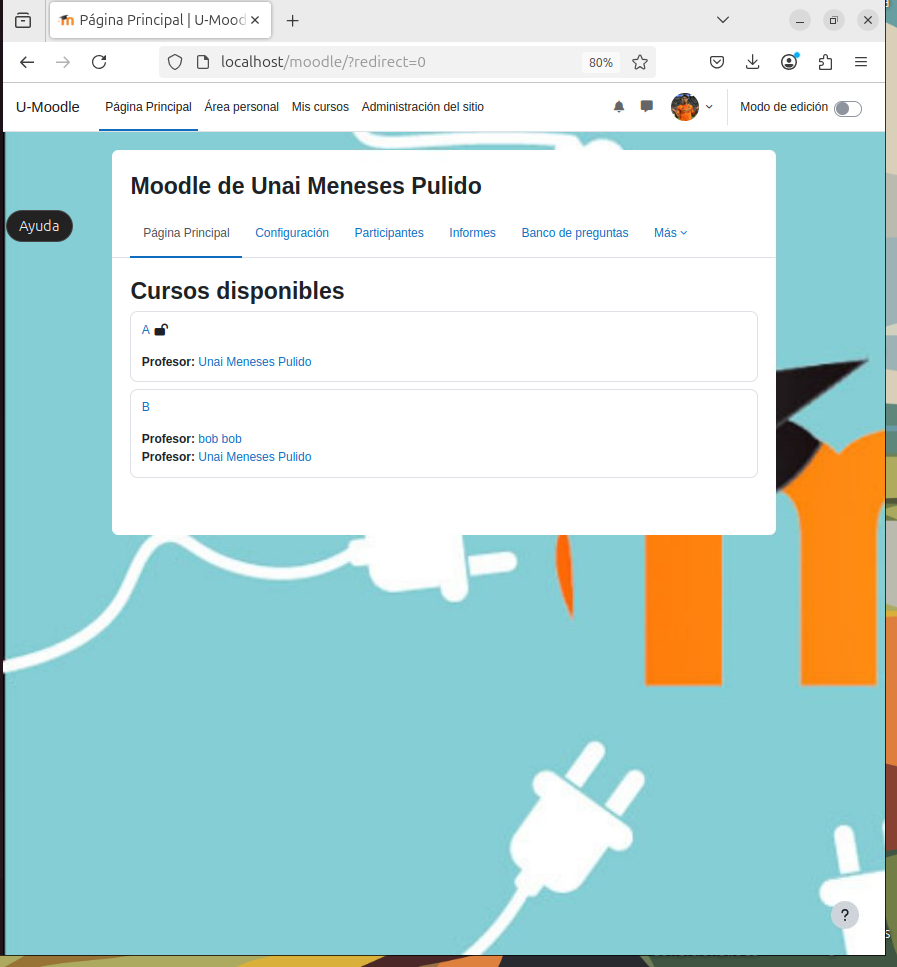

# Configuración de Moodle

## 1. Configuración
### a) Modificación de perfil
1. Inicia sesión como administrador
2. Ve a tu perfil > **Editar perfil**
3. Cambia el correo electrónico y la contraseña
4. Sube un avatar

### b) Configuración del sitio
1. Ve a **Administración del sitio > Primera plana > Parámetros**
2. Cambia el nombre del sitio (largo y corto)
3. Configura la visibilidad para usuarios no autenticados

### c) Configuración de zona horaria
1. Accede a **Administración del sitio > Ubicación > Parámetros**
2. Selecciona la zona horaria correcta

### d) Configuración de idioma
1. Ve a **Administración del sitio > Idioma > Parámetros**
2. Ajusta el idioma predeterminado y activa la detección automática
3. Para nuevos idiomas, instala paquetes en **Idioma > Paquetes de idioma**

### e) Política de Contraseñas
1. Ve a **Administración del sitio > Seguridad > Normativas del sitio**
2. Ajusta la política para exigir mínimo 4 caracteres, incluyendo mayúsculas, minúsculas y números

## 2. Creación de cursos
1. Accede a **Administración del sitio > Gestiona cursos y categorías**
2. Crea:
- Curso A con 3 temas
- Curso B con 5 temas

## 3. Gestión de contenidos
1. Accede a uno de los cursos creados
2. Activa la edición
3. Agrega un archivo PDF
4. Modifica títulos y experimenta con opciones de edición

## 4. Creación y gestión de usuarios
### a) Crear Usuario Manualmente
1. Ve a **Administración del sitio > Usarios > Cuentas > Agregar un usuario**
2. Crea el usuario **Bob** con autenticación manual

### b) Creación de alumnos
1. Accede a **Administración del sitio > Usarios > Cuentas > Cargar usuarios**
2. Sube un archivo CSV con 10 alumnos

### c) Eliminación de usuarios
1. Accede a **Administración del sitio > Usarios > Acciones con usuarios en bloque**
2. Elimina dos de los alumnos creados

## 5. Matriculación de usuarios
### a) Configurar métodos de inscripción
1. En el curso **A**, permite solo acceso de visitante
2. En el curso **B**, habilita la inscripción manual

### b) Asignar usuarios
1. Asigna a Bob como profesor del curso B
2. Matricula a los alumnos creados en el curso B

### c) Verificación de accesibilidad
1. Confirma que el curso **A** es público
2. Confirma que el curso **B** requiere autenticación

## 6. Personalización del Moodle
1. Descarga e instala un tema desde **Administración del sitio > Connectors > Instalar complemento**
2. Cambia la cabecera y el pie de página en **Administración del sitio > Apariencia > Temas > Selector de temas**

## 7. Seguridad
1. Bloquea una IP en **Administración del sitio > Seguridad**
2. Aplica una política de seguridad y justifica su implementación

